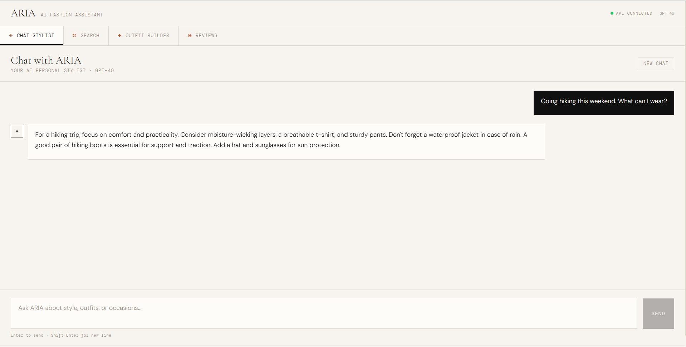

<div align="center">

# ARIA - AI Commerce Assistant

### AI-powered product discovery and conversion engine for e-commerce platforms

*Conversational Shopping · Semantic Discovery · Outfit Intelligence · Review Analysis*

**[▶ Try Live Demo](https://ai-shopping-assistant-sooty.vercel.app)**  ·  **[View API](https://web-production-a18aa.up.railway.app/docs)**  ·  **[Case Study](docs/case-study.md)**



</div>

---

## What is ARIA?

ARIA is an AI shopping assistant designed to increase conversion and improve product discovery in fashion e-commerce.

Instead of forcing users to browse filters and grids, ARIA lets them **describe what they want in natural language** and returns curated, context-aware recommendations.

**Core insight:**
Shoppers don’t search by SKU. They search by occasion, intent, and feeling.
ARIA is built to understand and respond to that.

---

## Why It Matters (Business Impact)

* Improves product discovery beyond keyword search
* Reduces decision friction for customers
* Increases average order value through outfit recommendations
* Builds trust using structured review intelligence

ARIA turns browsing into a guided experience.

---

## Core Capabilities

### 💬 Conversational Stylist

Understands user intent (occasion, budget, style) and responds with structured, relevant recommendations in natural language.

---

### 🔍 Semantic Product Search

Matches meaning, not keywords. Retrieves and ranks products based on context, relevance, and style alignment.

---

### 👗 Outfit Generation

Builds complete, cohesive outfits from a single item using style reasoning and catalogue constraints.

---

### ⭐ Review Intelligence

Summarises customer reviews into actionable insights:

* Pros / cons
* Sizing guidance
* Sentiment by category
* Key takeaway quotes

---

## Example Interaction

> “I need something elegant for a wedding guest, budget around $150”

→ ARIA interprets intent
→ Searches semantically
→ Re-ranks results for occasion fit
→ Returns curated recommendations with reasoning

---

## System Overview

```
Frontend (React)
    ↓
API Layer (FastAPI)
    ↓
AI Orchestration Layer
    ↓
LLM + Embeddings + Vector Search
```

Full architecture: `docs/architecture.md`

---

## Prompting & Intelligence

ARIA uses task-specific prompt structures tailored for:

* Intent extraction
* Search ranking
* Outfit composition
* Review summarisation

Each prompt is designed for consistency, control, and measurable output quality.

See simplified examples: `docs/prompts.md`

---

## Evaluation Approach

ARIA is built with evaluation in mind, not just demonstration.

Key metrics include:

* Retrieval quality (Precision@K, ranking accuracy)
* Response quality (LLM-based evaluation)
* Structural correctness of outputs
* Faithfulness of generated summaries

Overview: `docs/evaluation.md`

---

## Tech Stack

* **LLM:** OpenAI GPT-4o
* **Embeddings:** OpenAI text-embedding-3-small
* **Backend:** FastAPI
* **Vector Search:** FAISS
* **Frontend:** React + Tailwind
* **Deployment:** Vercel + Railway

---

## Integration Options

ARIA is designed to plug into existing e-commerce systems:

* Embed as a **chat widget** on product or homepage
* Use as a **backend API layer** for intelligent search
* Deploy as a **white-labelled assistant**

Supports custom catalogues and brand-specific configuration.

More details: `docs/features.md`

---

## Repository Overview

```
aria-ai-commerce/
├── docs/
│   ├── architecture.md
│   ├── features.md
│   ├── prompts.md
│   ├── case-study.md
│   └── evaluation.md
└── screenshots/
```

---

## Live Demo

Experience the product directly:
👉 https://ai-shopping-assistant-sooty.vercel.app

---

## Contact

**Available for integration projects and enterprise licensing.**

- Email: chuksprompts@gmail.com
- Twitter/X: [x.com/ChuksForge](https://x.com/ChuksForge)

---

<div align="center">
<sub>Built with GPT-4o · FastAPI · React · FAISS</sub>
</div>
